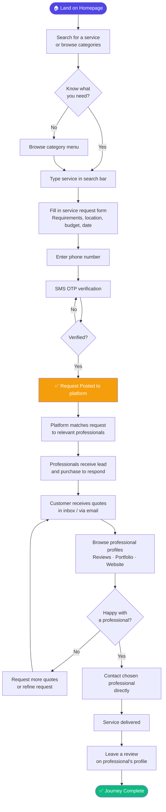
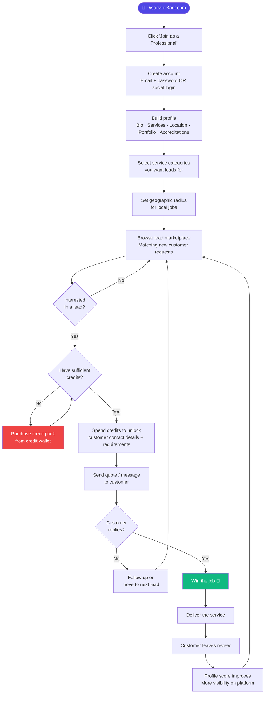
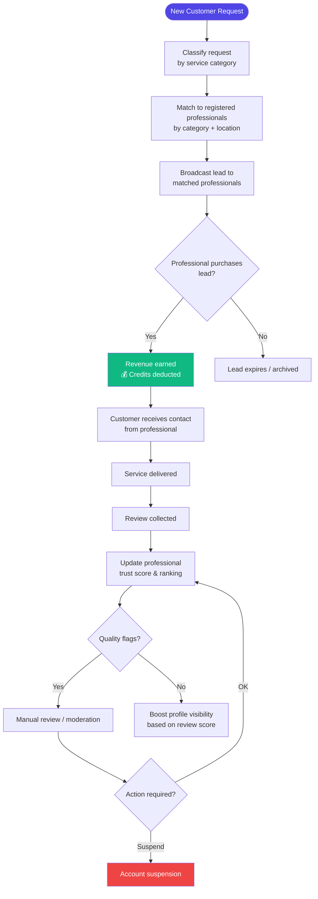
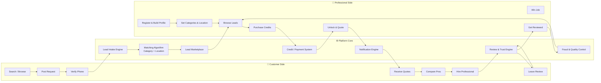
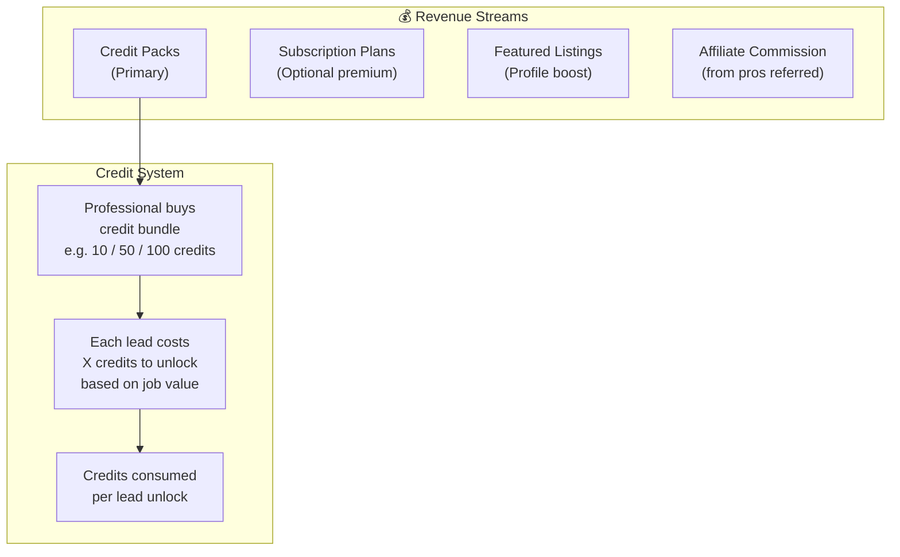

# Bark.com — Business Analysis & User Journey

> **Purpose:** Deep-dive analysis of [Bark.com](https://www.bark.com/en/gb/) to understand its product architecture, user journeys, and key modules — as a blueprint for building a similar two-sided services marketplace.

---

## Table of Contents

1. [Business Model Overview](#1-business-model-overview)
2. [Platform Architecture — Key Modules](#2-platform-architecture--key-modules)
3. [Service Categories Taxonomy](#3-service-categories-taxonomy)
4. [Customer Journey (End-to-End)](#4-customer-journey-end-to-end)
5. [Professional (Seller) Journey (End-to-End)](#5-professional-seller-journey-end-to-end)
6. [Platform / Admin Journey](#6-platform--admin-journey)
7. [Full System Flow Diagram](#7-full-system-flow-diagram)
8. [Revenue Model](#8-revenue-model)
9. [Key Features & Components](#9-key-features--components)
10. [Building a Similar Business — Blueprint](#10-building-a-similar-business--blueprint)

---

## 1. Business Model Overview

Bark.com is a **two-sided marketplace** that connects **customers** who need a service with **professionals** who provide it.

| Dimension | Detail |
|-----------|--------|
| **Type** | Lead generation marketplace (B2C & B2B) |
| **Revenue model** | Professionals pay credits to access/unlock customer leads |
| **Customer cost** | Free — customers post requests at zero cost |
| **Geographic reach** | UK, US, Canada, Ireland, South Africa, Australia, NZ, Singapore, France, Germany |
| **Category breadth** | 200+ service categories across 6 verticals |
| **Monetisation** | Credit-based lead purchase system (not pure subscription) |

**Core Value Propositions:**

- **For Customers:** Free, fast access to multiple quotes from vetted professionals
- **For Professionals:** A steady pipeline of warm, intent-rich leads without cold outreach

---

## 2. Platform Architecture — Key Modules

```
┌─────────────────────────────────────────────────────────────────────────┐
│                          BARK.COM PLATFORM                              │
├──────────────────┬──────────────────────┬───────────────────────────────┤
│  CUSTOMER MODULE │  PROFESSIONAL MODULE  │      PLATFORM / ADMIN         │
├──────────────────┼──────────────────────┼───────────────────────────────┤
│ • Search         │ • Registration       │ • Lead matching algorithm     │
│ • Request form   │ • Profile builder    │ • Credit system               │
│ • Quote inbox    │ • Category mgmt      │ • Fraud / quality control     │
│ • Pro profiles   │ • Lead marketplace   │ • Review & trust system       │
│ • Reviews        │ • Credit wallet      │ • Notification engine         │
│ • Phone verify   │ • Quote builder      │ • Payment gateway             │
│ • Mobile app     │ • Analytics          │ • CMS / SEO pages             │
│ • Login / Auth   │ • Mobile app         │ • Help centre / Support       │
│                  │ • Pricing plans      │ • Affiliate programme         │
└──────────────────┴──────────────────────┴───────────────────────────────┘
```

---

## 3. Service Categories Taxonomy

Bark operates across **6 major verticals**, each with multiple subcategories:

### 3.1 Business Services
- Accounting / Bookkeeping
- Business Consulting
- Mobile Software Development
- Search Engine Optimisation (SEO)
- Security Guard Services
- Social Media Marketing
- Web Design

### 3.2 Events & Entertainers
- Catering
- DJ
- Event & Party Planners
- Magician
- Wedding Cakes
- Wedding Car Hire
- Wedding Catering
- Wedding Flowers / Florists

### 3.3 Health & Wellness
- Counselling / Therapy
- Hypnotherapy
- Massage Therapy
- Nutritionists & Dietitians
- Personal Training
- Relationship & Marriage Counselling

### 3.4 House & Home
- Architectural Services
- CCTV Installation
- Fence & Gate Installation
- Garden Clearance
- Gardening / Landscaping
- Gutter Cleaning
- House Cleaning

### 3.5 Lessons & Training
- Business & Career Coaching
- English Lessons
- Guitar / Piano / Singing Lessons
- Maths Tutoring
- General Tutoring

### 3.6 More / Other
- Airport Transfers
- General Photography
- Graphic Design
- Immigration Lawyers
- Limousine Hire
- Private Investigators
- Wills & Estate Planning

---

## 4. Customer Journey (End-to-End)

### Flow Diagram



### Customer Journey Steps — Detailed

| Step | Action | Platform Touchpoint |
|------|--------|---------------------|
| 1 | Arrives via SEO / ad / referral | Homepage / Category landing page |
| 2 | Searches for service or browses | Search bar + Category navigation |
| 3 | Fills in request form | Multi-step wizard (service type, location, requirements, date, budget) |
| 4 | Phone verification | SMS OTP modal |
| 5 | Request goes live | Automated lead broadcast to matched professionals |
| 6 | Receives quotes | Email + in-app notifications |
| 7 | Reviews professionals | Professional profile page (bio, reviews, portfolio, accreditations) |
| 8 | Selects professional | Direct message / contact reveal |
| 9 | Work completed offline | No platform involvement in delivery |
| 10 | Leaves review | Star rating + written review on profile |

---

## 5. Professional (Seller) Journey (End-to-End)

### Flow Diagram



### Professional Journey Steps — Detailed

| Step | Action | Platform Touchpoint |
|------|--------|---------------------|
| 1 | Signs up as professional | Registration form |
| 2 | Builds profile | Profile editor (photo, bio, services, portfolio, certifications) |
| 3 | Sets service categories & location | Category selector + geo radius picker |
| 4 | Receives lead notifications | Email + push notification + in-app feed |
| 5 | Views lead preview | Lead card (service type, location, rough requirements — masked) |
| 6 | Purchases credits | Payment gateway (Stripe / similar) |
| 7 | Unlocks lead | Full customer requirements + contact details revealed |
| 8 | Sends quote | Messaging / quote builder tool |
| 9 | Wins job (offline) | Platform not involved in transaction |
| 10 | Gets reviewed | Star rating added to public profile |

---

## 6. Platform / Admin Journey



---

## 7. Full System Flow Diagram



---

## 8. Revenue Model



### Pricing Logic

| Lead Type | Approximate Credit Cost |
|-----------|------------------------|
| Low-value service (dog grooming) | Low credits |
| Mid-value service (web design) | Medium credits |
| High-value service (architect) | High credits |
| Job value is estimated | Credits scale with potential revenue |

---

## 9. Key Features & Components

### 9.1 Customer-Facing Features

| Feature | Description |
|---------|-------------|
| **Smart Search** | Autocomplete search with 200+ service categories |
| **Request Wizard** | Multi-step form capturing service requirements, location, timeline, budget |
| **Phone Verification** | SMS OTP to reduce spam requests |
| **Quote Inbox** | Receive and compare multiple quotes in one place |
| **Professional Profiles** | Reviews, ratings, portfolio, certifications, response rate |
| **Review System** | Post-service star rating + written review |
| **Mobile App** | iOS & Android apps for on-the-go |
| **Email Notifications** | Quote alerts, status updates |

### 9.2 Professional-Facing Features

| Feature | Description |
|---------|-------------|
| **Profile Builder** | Rich profile with bio, photos, portfolio, accreditations, social links |
| **Category Manager** | Select services offered + geographic radius |
| **Lead Feed** | Real-time feed of matching customer requests |
| **Credit Wallet** | Buy and manage credits; track spend |
| **Lead Preview** | See masked lead before deciding to purchase |
| **Quote Tool** | Send structured quotes to customers |
| **Analytics Dashboard** | Views, quote success rate, profile performance |
| **Review Management** | Respond to reviews publicly |
| **Help Centre** | Self-serve documentation + support tickets |
| **Mobile App** | Manage leads and profile on mobile |

### 9.3 Platform / Admin Features

| Feature | Description |
|---------|-------------|
| **Matching Algorithm** | Matches requests to professionals by category, location, availability |
| **Lead Scoring** | Ranks lead quality (job value, customer intent, verification status) |
| **Fraud Detection** | Flags suspicious accounts, fake requests, spam professionals |
| **Trust & Safety** | Review moderation, professional vetting, dispute resolution |
| **SEO Landing Pages** | "Plumbers in London", "Accountants in Manchester" — thousands of pages |
| **Notification Engine** | Email, SMS, push for both sides |
| **Payment Gateway** | Stripe / Braintree integration for credit purchases |
| **Affiliate Programme** | Revenue share for referring professionals |
| **Internationalisation** | Multi-country, multi-language, multi-currency |
| **Trustpilot Integration** | Social proof on homepage |

---

## 10. Building a Similar Business — Blueprint

### Phase 1: MVP (Months 1–3)

```
Customer side:
✅ Homepage with search + category browsing
✅ Service request form (wizard)
✅ Phone / email verification
✅ Notification when quotes received

Professional side:
✅ Registration + profile builder
✅ Category & location selection
✅ Lead feed (matching leads)
✅ Ability to contact customer (no credits yet — free in MVP)

Platform:
✅ Basic matching algorithm (category + location)
✅ Admin dashboard (manage users, leads, categories)
✅ Email notification engine
```

### Phase 2: Monetisation (Months 4–6)

```
✅ Credit system (buy credits, spend to unlock leads)
✅ Stripe payment integration
✅ Lead previews (masked before purchase)
✅ Review & rating system
✅ Professional analytics dashboard
```

### Phase 3: Growth (Months 7–12)

```
✅ SEO landing pages (city × service combinations)
✅ Mobile apps (iOS & Android)
✅ Subscription / premium plans for professionals
✅ Featured listing / profile boost
✅ Affiliate / referral programme
✅ Fraud detection & trust engine
✅ Multi-region / internationalisation
```

### Core Tech Stack Recommendation

| Layer | Technology |
|-------|-----------|
| **Framework** | Next.js (SSR for SEO) or Wasp (full-stack) |
| **Database** | PostgreSQL + Prisma ORM |
| **Auth** | Email + SMS OTP + OAuth (Google) |
| **Payments** | Stripe (credits + subscriptions) |
| **Notifications** | SendGrid (email) + Twilio (SMS) + Firebase (push) |
| **Search** | Algolia or PostgreSQL full-text search |
| **Maps / Geo** | Google Maps API (location matching) |
| **Storage** | AWS S3 (profile images, portfolio) |
| **Analytics** | Mixpanel / PostHog |
| **Hosting** | Vercel + Railway / Fly.io |

### Key Differentiators to Consider

1. **Niche focus** — Start with 1–3 categories instead of 200+
2. **Trust first** — Verified professional badges, background checks
3. **Better UX** — Streamlined quote comparison, in-platform messaging
4. **Transparent pricing** — Show credit cost upfront per lead
5. **Customer guarantees** — Satisfaction guarantee or money back
6. **Professional analytics** — Show pros their ROI from the platform

---

## Summary

Bark.com's success comes from three pillars:

1. **Free for customers** — Zero friction to post a request drives demand
2. **Pay-per-lead for professionals** — Aligns revenue with platform value delivery
3. **SEO at scale** — Thousands of "service + city" pages drive organic traffic

Replicating this model requires building both sides of the marketplace simultaneously, with initial focus on supply (professional onboarding) to ensure customers receive quotes quickly — otherwise the flywheel stalls.

---

*Document created: May 2026*
*Source: [Bark.com](https://www.bark.com/en/gb/)*
